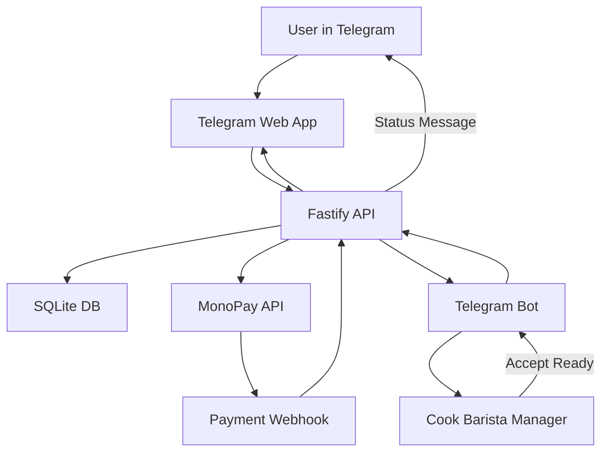

# План Telegram Web App MVP для заведений питания

## 1. Главная идея шаблона

Делаем не одноразовый проект под одно кафе, а white-label шаблон: код остается одинаковым, а конкретный бизнес меняется через конфиги, seed-меню и переменные окружения.

Основные принципы:

- один репозиторий с разделением на Web App, API, Telegram bot, shared types и config;
- все бизнес-настройки клиента вынести в `[packages/config/tenants/default.client.json](packages/config/tenants/default.client.json)`;
- секреты хранить только в `.env`, а не в клиентских JSON;
- core-сущности сразу проектировать с `tenant_id`, даже если в MVP будет один клиент;
- staff MVP делать через Telegram-сообщения с inline-кнопками, без отдельной админки;
- админ-панель на базе `satnaing/shadcn-admin` оставить как следующий этап, если понадобится полноценный dashboard.

Рекомендуемая структура:

```text
SmartFood_bot/
├── apps/
│   ├── webapp/              # Telegram Mini App для клиента
│   ├── api/                 # Node.js + Fastify backend
│   └── bot/                 # Telegram bot для staff-уведомлений
├── packages/
│   ├── config/              # tenant configs, theme, features, loyalty rules
│   ├── db/                  # SQLite schema, migrations, seed
│   ├── shared/              # TypeScript types, Zod schemas, enums
│   └── telegram/            # initData validation, bot helpers
├── docs/
│   ├── ARCHITECTURE.md
│   ├── API.md
│   └── MVP-SCOPE.md
├── .env.example
└── package.json
```

## 2. Архитектура потока




MVP-поведение:

- клиент открывает Web App из Telegram;
- Web App валидирует Telegram `initData` через backend;
- клиент выбирает товары, добавляет аллергены/предпочтения, открывает корзину;
- API создает заказ в статусе `draft` или `pending_payment`;
- MonoPay создает invoice, пользователь платит через Apple Pay / Google Pay;
- MonoPay webhook подтверждает оплату;
- API начисляет будущие loyalty points и отправляет заказ персоналу в Telegram;
- повар/бариста нажимает `Принять`, затем `Готово`;
- клиент видит обновленный статус заказа и получает Telegram-уведомление.

## 3. Frontend: Telegram Web App

Стек:

- Vite + React + TypeScript;
- `@telegram-apps/sdk` или актуальный Telegram Mini Apps SDK;
- Tailwind CSS + shadcn/ui для аккуратного минималистичного UI;
- TanStack Query для server state;
- Zustand или маленький React store для корзины;
- Zod-схемы из `[packages/shared](packages/shared)`.

Основные страницы:

- `HomePage`: название заведения, категории меню, карточки товаров, loyalty badge, последние заказы;
- `ProductDetailsPage` или modal/drawer: цена, состав, вес/объем, среднее время приготовления, выбор опций;
- `CartPage`: позиции, комментарии, итог, скидка за баллы, ожидаемые баллы за заказ;
- `OrdersPage`: история заказов и текущие статусы;
- `LoyaltyPage`: баланс баллов, эквивалент в гривнах, история начислений/списаний.

Карточка товара должна показывать:

- название;
- фото или fallback-заглушку;
- цену в гривнах;
- вес в граммах для еды или объем в миллилитрах для напитков;
- короткий состав;
- среднее время приготовления;
- кнопку выбора.

Опции товара:

- `service_type`: `dine_in` / `takeaway`;
- `allergens_note`: свободный текст;
- `preferences_note`: свободный текст;
- quantity;
- модификаторы, если будут нужны позже: размер, молоко, сироп, острота и т.д.

После добавления товара:

- показать bottom sheet: `Перейти в корзину` или `Продолжить выбор`;
- при продолжении возвращать на главную с сохраненной корзиной;
- при переходе в корзину показывать итог, скидку за loyalty points и оплату.

## 4. Дизайн и theme system

В `[packages/config/tenants/default.client.json](packages/config/tenants/default.client.json)` заложить:

```json
{
  "tenantId": "demo-cafe",
  "venue": {
    "name": "Demo Cafe",
    "locale": "uk-UA",
    "currency": "UAH"
  },
  "theme": {
    "mode": "telegram",
    "colors": {
      "primary": "#22c55e",
      "background": "#ffffff",
      "surface": "#f8fafc",
      "text": "#111827"
    }
  },
  "loyalty": {
    "earnRatePercent": 5,
    "pointToUah": 0.1,
    "maxSpendPercentOfOrder": 30
  },
  "features": {
    "loyalty": true,
    "drinkOptions": true,
    "staffTelegramFlow": true
  }
}
```

Theme logic:

- если `theme.mode = "telegram"`, брать цвета из Telegram theme params;
- если `theme.mode = "custom"`, применять цвета бизнеса;
- сделать CSS variables: `--color-primary`, `--color-bg`, `--color-surface`, `--color-text`;
- UI должен быть минималистичным: крупные карточки, понятные кнопки, sticky cart button, без перегруза.

## 5. Backend: Fastify + SQLite

Стек:

- Node.js + Fastify;
- SQLite через Drizzle ORM + `better-sqlite3` или `libsql`;
- Zod для request/response validation;
- `@fastify/cors`, `@fastify/helmet`, `@fastify/rate-limit`, `@fastify/env`;
- отдельные service modules для заказов, оплаты, loyalty и Telegram notifications.

Рекомендуемые API-модули в `[apps/api/src](apps/api/src)`:

- `plugins/env.ts`;
- `plugins/db.ts`;
- `plugins/errors.ts`;
- `middleware/telegramAuth.ts`;
- `middleware/tenant.ts`;
- `middleware/rbac.ts`;
- `routes/menu.ts`;
- `routes/cart.ts`;
- `routes/orders.ts`;
- `routes/loyalty.ts`;
- `routes/payments.ts`;
- `routes/staff.ts`;
- `services/orderService.ts`;
- `services/paymentService.ts`;
- `services/loyaltyService.ts`;
- `services/telegramNotifyService.ts`.

Middleware:

- `tenantMiddleware`: определяет `tenant_id` из config, env или Telegram start param;
- `telegramAuthMiddleware`: проверяет подпись Telegram `initData`;
- `customerMiddleware`: создает/обновляет пользователя по Telegram ID;
- `staffRbacMiddleware`: проверяет роль staff по Telegram ID;
- `rateLimitMiddleware`: ограничивает checkout/payment endpoints;
- `errorMiddleware`: единый формат ошибок;
- `webhookSignatureMiddleware`: проверяет MonoPay webhook, насколько это поддерживается API MonoPay.

## 6. SQLite схема

Минимальные таблицы:

```sql
CREATE TABLE tenants (
  id TEXT PRIMARY KEY,
  name TEXT NOT NULL,
  config_json TEXT NOT NULL,
  created_at TEXT NOT NULL DEFAULT CURRENT_TIMESTAMP
);

CREATE TABLE customers (
  id TEXT PRIMARY KEY,
  tenant_id TEXT NOT NULL,
  telegram_id TEXT NOT NULL,
  first_name TEXT,
  last_name TEXT,
  username TEXT,
  phone TEXT,
  created_at TEXT NOT NULL DEFAULT CURRENT_TIMESTAMP,
  updated_at TEXT NOT NULL DEFAULT CURRENT_TIMESTAMP,
  UNIQUE (tenant_id, telegram_id)
);

CREATE TABLE categories (
  id TEXT PRIMARY KEY,
  tenant_id TEXT NOT NULL,
  name TEXT NOT NULL,
  sort_order INTEGER NOT NULL DEFAULT 0,
  is_active INTEGER NOT NULL DEFAULT 1
);

CREATE TABLE products (
  id TEXT PRIMARY KEY,
  tenant_id TEXT NOT NULL,
  category_id TEXT NOT NULL,
  name TEXT NOT NULL,
  description TEXT,
  composition TEXT,
  image_url TEXT,
  price_uah_cents INTEGER NOT NULL,
  measure_value INTEGER NOT NULL,
  measure_unit TEXT NOT NULL CHECK (measure_unit IN ('g', 'ml')),
  avg_prep_time_minutes INTEGER NOT NULL,
  is_active INTEGER NOT NULL DEFAULT 1,
  sort_order INTEGER NOT NULL DEFAULT 0
);

CREATE TABLE orders (
  id TEXT PRIMARY KEY,
  tenant_id TEXT NOT NULL,
  customer_id TEXT NOT NULL,
  status TEXT NOT NULL,
  subtotal_uah_cents INTEGER NOT NULL,
  loyalty_discount_uah_cents INTEGER NOT NULL DEFAULT 0,
  total_uah_cents INTEGER NOT NULL,
  loyalty_points_spent INTEGER NOT NULL DEFAULT 0,
  loyalty_points_earned INTEGER NOT NULL DEFAULT 0,
  payment_provider TEXT,
  payment_invoice_id TEXT,
  payment_status TEXT NOT NULL DEFAULT 'unpaid',
  customer_note TEXT,
  created_at TEXT NOT NULL DEFAULT CURRENT_TIMESTAMP,
  updated_at TEXT NOT NULL DEFAULT CURRENT_TIMESTAMP
);

CREATE TABLE order_items (
  id TEXT PRIMARY KEY,
  order_id TEXT NOT NULL,
  product_id TEXT NOT NULL,
  product_snapshot_json TEXT NOT NULL,
  quantity INTEGER NOT NULL,
  unit_price_uah_cents INTEGER NOT NULL,
  total_price_uah_cents INTEGER NOT NULL,
  service_type TEXT CHECK (service_type IN ('dine_in', 'takeaway')),
  allergens_note TEXT,
  preferences_note TEXT
);

CREATE TABLE loyalty_accounts (
  id TEXT PRIMARY KEY,
  tenant_id TEXT NOT NULL,
  customer_id TEXT NOT NULL,
  points_balance INTEGER NOT NULL DEFAULT 0,
  updated_at TEXT NOT NULL DEFAULT CURRENT_TIMESTAMP,
  UNIQUE (tenant_id, customer_id)
);

CREATE TABLE loyalty_transactions (
  id TEXT PRIMARY KEY,
  tenant_id TEXT NOT NULL,
  customer_id TEXT NOT NULL,
  order_id TEXT,
  type TEXT NOT NULL CHECK (type IN ('earn', 'spend', 'refund', 'adjustment')),
  points INTEGER NOT NULL,
  uah_equivalent_cents INTEGER NOT NULL DEFAULT 0,
  created_at TEXT NOT NULL DEFAULT CURRENT_TIMESTAMP
);

CREATE TABLE staff_members (
  id TEXT PRIMARY KEY,
  tenant_id TEXT NOT NULL,
  telegram_id TEXT NOT NULL,
  role TEXT NOT NULL CHECK (role IN ('cook', 'barista', 'manager', 'admin')),
  is_active INTEGER NOT NULL DEFAULT 1,
  UNIQUE (tenant_id, telegram_id)
);

CREATE TABLE order_events (
  id TEXT PRIMARY KEY,
  tenant_id TEXT NOT NULL,
  order_id TEXT NOT NULL,
  actor_type TEXT NOT NULL,
  actor_id TEXT,
  event_type TEXT NOT NULL,
  payload_json TEXT,
  created_at TEXT NOT NULL DEFAULT CURRENT_TIMESTAMP
);
```

Индексы:

- `orders(tenant_id, customer_id, created_at)`;
- `orders(tenant_id, status, created_at)`;
- `products(tenant_id, category_id, is_active)`;
- `loyalty_transactions(tenant_id, customer_id, created_at)`;
- `order_events(order_id, created_at)`.

Статусы заказа:

- `draft`;
- `pending_payment`;
- `paid`;
- `accepted`;
- `preparing`;
- `ready`;
- `completed`;
- `cancelled`;
- `payment_failed`.

Для MVP можно объединить `accepted` и `preparing`, но в схеме лучше оставить оба для роста.

## 7. API endpoints

Customer endpoints:

- `GET /api/app/bootstrap` — конфиг клиента, venue, theme, loyalty summary, customer profile;
- `GET /api/menu` — категории и активные товары;
- `GET /api/menu/products/:id` — детальная карточка товара;
- `POST /api/orders/preview` — посчитать корзину, скидку баллами и будущие баллы;
- `POST /api/orders` — создать заказ;
- `GET /api/orders` — история заказов пользователя;
- `GET /api/orders/:id` — детали и статус заказа;
- `POST /api/orders/:id/cancel` — отмена до оплаты или до принятия;
- `GET /api/loyalty` — баланс, эквивалент в UAH, история;
- `POST /api/payments/monopay/invoice` — создать invoice для заказа;
- `POST /api/payments/monopay/webhook` — обработать MonoPay callback.

Staff/bot endpoints:

- `POST /api/staff/orders/:id/accept` — принять заказ;
- `POST /api/staff/orders/:id/ready` — отметить готовым;
- `POST /api/staff/orders/:id/cancel` — отменить с причиной;
- `GET /api/staff/orders/active` — список активных заказов, если позже появится dashboard.

Internal/admin seed endpoints в production лучше не открывать. Для MVP использовать CLI seed script:

- `pnpm db:migrate`;
- `pnpm db:seed --tenant demo-cafe`.

## 8. Логика backend

Order creation:

- API получает items из корзины;
- заново подтягивает цены товаров из DB;
- делает snapshot товара в `order_items.product_snapshot_json`;
- считает subtotal;
- валидирует loyalty points;
- создает заказ `pending_payment`;
- создает MonoPay invoice.

Payment confirmed:

- webhook находит заказ по `payment_invoice_id`;
- меняет `payment_status` на `paid`;
- меняет order status на `paid`;
- начисляет loyalty points только после успешной оплаты;
- отправляет сообщение staff-группе или конкретным staff users.

Staff accept:

- Telegram bot получает callback query;
- проверяет staff role;
- вызывает API `accept`;
- API меняет статус на `accepted/preparing`;
- пишет событие в `order_events`;
- уведомляет клиента.

Staff ready:

- staff нажимает `Готово`;
- API меняет статус на `ready`;
- пишет событие;
- отправляет клиенту сообщение `ваше замовлення готове`;
- Web App при открытии видит актуальный статус.

Loyalty:

- points начисляются только на фактически оплаченный total после скидки;
- points можно списывать до лимита `maxSpendPercentOfOrder`;
- `pointToUah` задает гривневый эквивалент;
- пользователь видит баланс и эквивалент в гривнах;
- на главной иконка loyalty показывает число баллов и ведет на `LoyaltyPage`.

## 9. Staff workflow без админки

MVP staff-flow:

- создать Telegram-группу или список staff Telegram IDs в config/env;
- бот отправляет заказ в группу:
  - номер заказа;
  - позиции и количество;
  - аллергены;
  - предпочтения;
  - dine-in/takeaway;
  - сумма;
  - кнопки `Принять`, `Готово`, `Отменить`;
- после нажатия кнопки бот редактирует сообщение, чтобы staff видел актуальный статус;
- клиент получает обновление статуса через Web App и Telegram-сообщение.

Найденный шаблон для будущей админки:

- `satnaing/shadcn-admin` — бесплатный MIT, React + Vite + TypeScript + shadcn/ui + TanStack Router;
- хорошо подходит для следующего этапа: управление меню, активные заказы, аналитика, staff roles;
- в MVP не используем, чтобы не растягивать сроки.

## 10. Что делать в первую очередь

Этап 1: scaffold

- создать monorepo;
- настроить TypeScript, lint, prettier;
- создать `apps/webapp`, `apps/api`, `apps/bot`, `packages/shared`, `packages/config`, `packages/db`;
- добавить `.env.example`.

Этап 2: DB и shared contracts

- описать enums, Zod-схемы и shared types;
- создать SQLite schema и migrations;
- добавить seed demo menu.

Этап 3: API MVP

- bootstrap endpoint;
- menu endpoints;
- order preview/create;
- loyalty summary;
- MonoPay invoice/webhook;
- staff status endpoints.

Этап 4: Telegram bot

- staff notifications;
- inline buttons;
- callback handling;
- client status notifications.

Этап 5: Web App MVP

- Telegram init/theme integration;
- главная с меню;
- карточка товара;
- корзина;
- loyalty badge/page;
- order history/status;
- payment flow.

Этап 6: polish

- responsive Telegram-native UI;
- empty/error/loading states;
- украинская локализация по умолчанию;
- smoke tests для API services;
- README: как адаптировать шаблон под нового клиента.

## 11. MVP acceptance criteria

MVP считается готовым, когда:

- новый клиент настраивается через tenant config и seed-меню без переписывания кода;
- пользователь может открыть Web App, выбрать товары, указать аллергены/предпочтения, оплатить заказ;
- loyalty points отображаются, начисляются и могут списываться по правилам config;
- персонал получает заказ в Telegram и меняет статус кнопками;
- клиент видит актуальный статус заказа;
- backend не доверяет frontend-ценам и всегда пересчитывает заказ на сервере;
- все ключевые действия пишутся в `order_events` для отладки и будущей аналитики.

